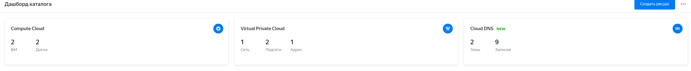

# Домашнее задание к занятию "15.1. Организация сети"

после terraform apply 



```bash
vladimir@node1:~/15-kubernetes-cloud/15.1$ ssh ubuntu@51.250.4.4
Welcome to Ubuntu 18.04.1 LTS (GNU/Linux 4.15.0-29-generic x86_64)

 * Documentation:  https://help.ubuntu.com
 * Management:     https://landscape.canonical.com
 * Support:        https://ubuntu.com/advantage

New release '20.04.3 LTS' available.
Run 'do-release-upgrade' to upgrade to it.


#################################################################
This instance runs Yandex.Cloud Marketplace product
Please wait while we configure your product...

Documentation for Yandex Cloud Marketplace images available at https://cloud.yandex.ru/docs

#################################################################

To run a command as administrator (user "root"), use "sudo <command>".
See "man sudo_root" for details.

ubuntu@fhmr6siprhmbufs3s98a:~$ ssh ubuntu@192.168.20.10
The authenticity of host '192.168.20.10 (192.168.20.10)' can't be established.
ECDSA key fingerprint is SHA256:W81M0nGTOev1r71n3mm1IstdtpyZWosHIxkw/mod6tM.
Are you sure you want to continue connecting (yes/no)? yes
Warning: Permanently added '192.168.20.10' (ECDSA) to the list of known hosts.
Welcome to Ubuntu 18.04.1 LTS (GNU/Linux 4.15.0-29-generic x86_64)

 * Documentation:  https://help.ubuntu.com
 * Management:     https://landscape.canonical.com
 * Support:        https://ubuntu.com/advantage


#################################################################
This instance runs Yandex.Cloud Marketplace product
Please wait while we configure your product...

Documentation for Yandex Cloud Marketplace images available at https://cloud.yandex.ru/docs

#################################################################


The programs included with the Ubuntu system are free software;
the exact distribution terms for each program are described in the
individual files in /usr/share/doc/*/copyright.

Ubuntu comes with ABSOLUTELY NO WARRANTY, to the extent permitted by
applicable law.

To run a command as administrator (user "root"), use "sudo <command>".
See "man sudo_root" for details.

ubuntu@fhm55p5ojnpq6qspv1b3:~$ ping ya.ru
PING ya.ru (87.250.250.242) 56(84) bytes of data.
64 bytes from ya.ru (87.250.250.242): icmp_seq=1 ttl=56 time=1.69 ms
64 bytes from ya.ru (87.250.250.242): icmp_seq=2 ttl=56 time=0.814 ms
64 bytes from ya.ru (87.250.250.242): icmp_seq=3 ttl=56 time=0.898 ms
64 bytes from ya.ru (87.250.250.242): icmp_seq=4 ttl=56 time=0.830 ms
```
## Задание 2*. AWS (необязательное к выполнению)

1. Создать VPC.
- Cоздать пустую VPC с подсетью 10.10.0.0/16.
2. Публичная подсеть.
- Создать в vpc subnet с названием public, сетью 10.10.1.0/24
- Разрешить в данной subnet присвоение public IP по-умолчанию. 
- Создать Internet gateway 
- Добавить в таблицу маршрутизации маршрут, направляющий весь исходящий трафик в Internet gateway.
- Создать security group с разрешающими правилами на SSH и ICMP. Привязать данную security-group на все создаваемые в данном ДЗ виртуалки
- Создать в этой подсети виртуалку и убедиться, что инстанс имеет публичный IP. Подключиться к ней, убедиться что есть доступ к интернету.
- Добавить NAT gateway в public subnet.
3. Приватная подсеть.
- Создать в vpc subnet с названием private, сетью 10.10.2.0/24
- Создать отдельную таблицу маршрутизации и привязать ее к private-подсети
- Добавить Route, направляющий весь исходящий трафик private сети в NAT.
- Создать виртуалку в приватной сети.
- Подключиться к ней по SSH по приватному IP через виртуалку, созданную ранее в публичной подсети и убедиться, что с виртуалки есть выход в интернет.

Resource terraform
- [VPC](https://registry.terraform.io/providers/hashicorp/aws/latest/docs/resources/vpc)
- [Subnet](https://registry.terraform.io/providers/hashicorp/aws/latest/docs/resources/subnet)
- [Internet Gateway](https://registry.terraform.io/providers/hashicorp/aws/latest/docs/resources/internet_gateway)
